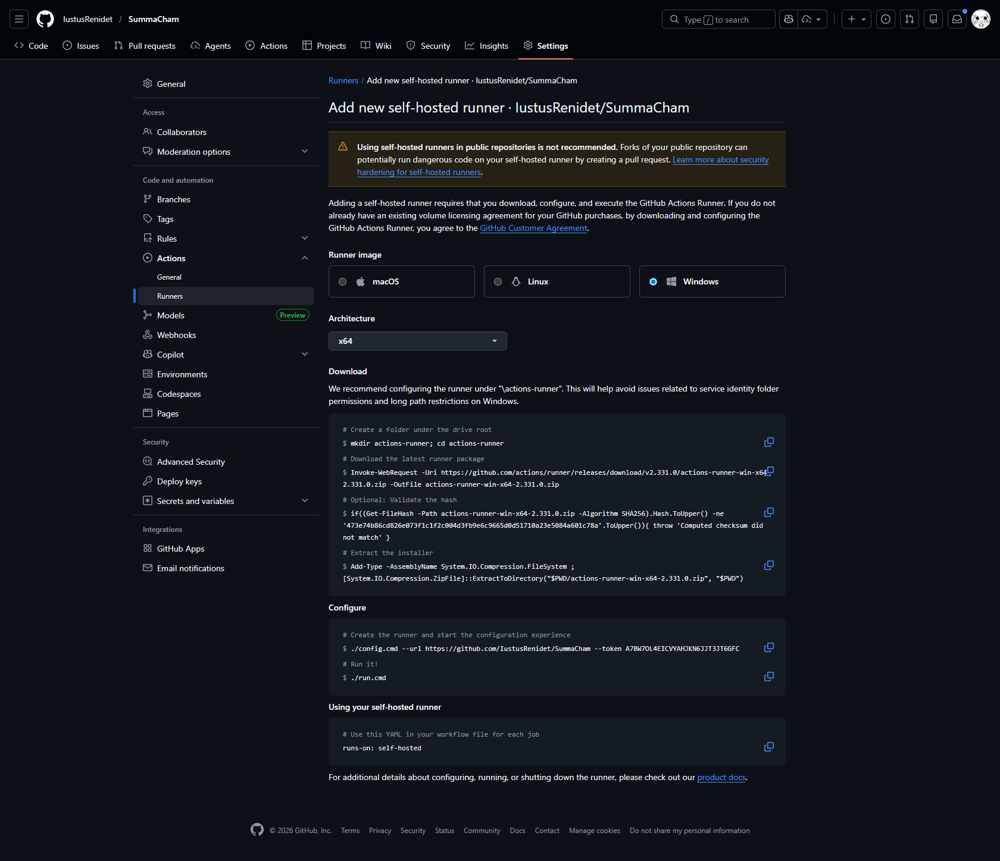

```
PS C:\Users\Administrador> mkdir actions-runner; cd actions-runner

                                                                                                                            Directorio: C:\Users\Administrador                                                                                                                                                                                                                                                                                                                                  Mode                 LastWriteTime         Length Name
----                 -------------         ------ ----
d-----     25/02/2026  04:59 p. m.                actions-runner


PS C:\Users\Administrador\actions-runner> Invoke-WebRequest -Uri https://github.com/actions/runner/releases/download/v2.331.0/actions-runner-win-x64-2.331.0.zip -OutFile actions-runner-win-x64-2.331.0.zip
PS C:\Users\Administrador\actions-runner> if((Get-FileHash -Path actions-runner-win-x64-2.331.0.zip -Algorithm SHA256).Hash.ToUpper() -ne '473e74b86cd826e073f1c1f2c004d3fb9e6c9665d0d51710a23e5084a601c78a'.ToUpper()){ throw 'Computed checksum did not match' }
PS C:\Users\Administrador\actions-runner> Add-Type -AssemblyName System.IO.Compression.FileSystem ; [System.IO.Compression.ZipFile]::ExtractToDirectory("$PWD/actions-runner-win-x64-2.331.0.zip", "$PWD")
PS C:\Users\Administrador\actions-runner> ./config.cmd --url https://github.com/IustusRenidet/SummaCham --token A7BW7OL4EICVYAHJKN6JJT3JT6GFC

--------------------------------------------------------------------------------
|        ____ _ _   _   _       _          _        _   _                      |
|       / ___(_) |_| | | |_   _| |__      / \   ___| |_(_) ___  _ __  ___      |
|      | |  _| | __| |_| | | | | '_ \    / _ \ / __| __| |/ _ \| '_ \/ __|     |
|      | |_| | | |_|  _  | |_| | |_) |  / ___ \ (__| |_| | (_) | | | \__ \     |
|       \____|_|\__|_| |_|\__,_|_.__/  /_/   \_\___|\__|_|\___/|_| |_|___/     |
|                                                                              |
|                       Self-hosted runner registration                        |
|                                                                              |
--------------------------------------------------------------------------------

# Authentication


V Connected to GitHub

# Runner Registration

Enter the name of the runner group to add this runner to: [press Enter for Default] ./run.cmd

Could not find any self-hosted runner group named "./run.cmd".
PS C:\Users\Administrador\actions-runner> ./config.cmd --url https://github.com/IustusRenidet/SummaCham --token A7BW7OL4EICVYAHJKN6JJT3JT6GFC

--------------------------------------------------------------------------------
|        ____ _ _   _   _       _          _        _   _                      |
|       / ___(_) |_| | | |_   _| |__      / \   ___| |_(_) ___  _ __  ___      |
|      | |  _| | __| |_| | | | | '_ \    / _ \ / __| __| |/ _ \| '_ \/ __|     |
|      | |_| | | |_|  _  | |_| | |_) |  / ___ \ (__| |_| | (_) | | | \__ \     |
|       \____|_|\__|_| |_|\__,_|_.__/  /_/   \_\___|\__|_|\___/|_| |_|___/     |
|                                                                              |
|                       Self-hosted runner registration                        |
|                                                                              |
--------------------------------------------------------------------------------

# Authentication


V Connected to GitHub

# Runner Registration

Enter the name of the runner group to add this runner to: [press Enter for Default] panelamcham_runner

Could not find any self-hosted runner group named "panelamcham_runner".
PS C:\Users\Administrador\actions-runner> ./config.cmd --url https://github.com/IustusRenidet/SummaCham --token A7BW7OL4EICVYAHJKN6JJT3JT6GFC

--------------------------------------------------------------------------------
|        ____ _ _   _   _       _          _        _   _                      |
|       / ___(_) |_| | | |_   _| |__      / \   ___| |_(_) ___  _ __  ___      |
|      | |  _| | __| |_| | | | | '_ \    / _ \ / __| __| |/ _ \| '_ \/ __|     |
|      | |_| | | |_|  _  | |_| | |_) |  / ___ \ (__| |_| | (_) | | | \__ \     |
|       \____|_|\__|_| |_|\__,_|_.__/  /_/   \_\___|\__|_|\___/|_| |_|___/     |
|                                                                              |
|                       Self-hosted runner registration                        |
|                                                                              |
--------------------------------------------------------------------------------

# Authentication


V Connected to GitHub

# Runner Registration

Enter the name of the runner group to add this runner to: [press Enter for Default]

Enter the name of runner: [press Enter for WIN-2M5BL6JAD1G] chamnner

This runner will have the following labels: 'self-hosted', 'Windows', 'X64'
Enter any additional labels (ex. label-1,label-2): [press Enter to skip]

V Runner successfully added

# Runner settings

Enter name of work folder: [press Enter for _work] }

V Settings Saved.

Would you like to run the runner as service? (Y/N) [press Enter for N] Y
User account to use for the service [press Enter for NT AUTHORITY\Servicio de red]
Granting file permissions to 'NT AUTHORITY\Servicio de red'.
Service actions.runner.IustusRenidet-SummaCham.chamnner successfully installed
Service actions.runner.IustusRenidet-SummaCham.chamnner successfully set recovery option
Service actions.runner.IustusRenidet-SummaCham.chamnner successfully set to delayed auto start
Service actions.runner.IustusRenidet-SummaCham.chamnner successfully configured
Waiting for service to start...
Service actions.runner.IustusRenidet-SummaCham.chamnner started successfully
PS C:\Users\Administrador\actions-runner> runs-on: self-hosted
runs-on: : El término 'runs-on:' no se reconoce como nombre de un cmdlet, función, archivo de script o programa
ejecutable. Compruebe si escribió correctamente el nombre o, si incluyó una ruta de acceso, compruebe que dicha ruta
es correcta e inténtelo de nuevo.
En línea: 1 Carácter: 1
+ runs-on: self-hosted
+ ~~~~~~~~
    + CategoryInfo          : ObjectNotFound: (runs-on::String) [], CommandNotFoundException
    + FullyQualifiedErrorId : CommandNotFoundException

PS C:\Users\Administrador\actions-runner>
```

1. Verificar que el runner esté **Online**
   - GitHub: **Repo > Settings > Actions > Runners**
   - Debe aparecer **chamnner** en verde.
2. Configurar **environment production** (ya lo creaste)
   - **Settings > Environments > production**
   - Ahí define variables/secrets, porque tu job usa **environment: production**.
3. Crear variables mínimas (Environment variables)
   - **DEPLOY_ENABLED=true**
   - **DEPLOY_MODE=source**
   - **DEPLOY_APP_DIR=C:\apps\SummaCham**
   - **DEPLOY_HEALTHCHECK_URL=http://127.0.0.1:3005/health** (opcional)
4. Crear secret mínimo (Environment secret)
   - **DEPLOY_RESTART_COMMAND=...** (tu comando de reinicio)
5. Probar con un tag

```
git tag v5.3.2-test1
git push origin v5.3.2-test1
```

```
PS C:\Users\Administrador\actions-runner> icacls "C:\Users\Administrador" /grant "*S-1-5-20:(RX)"
archivo procesado: C:\Users\Administrador
Se procesaron correctamente 1 archivos; error al procesar 0 archivos
PS C:\Users\Administrador\actions-runner> Restart-Service actions.runner.IustusRenidet-SummaCham.chamnner
PS C:\Users\Administrador\actions-runner> Resolve-DnsName actions.githubusercontent.com

Name                        Type TTL   Section    PrimaryServer               NameAdministrator           SerialNumber
----                        ---- ---   -------    -------------               -----------------           ------------
actions.githubusercontent.c SOA  459   Authority  ns-586.awsdns-09.net        awsdns-hostmaster.amazon.co 1
om                                                                            m


PS C:\Users\Administrador\actions-runner> Resolve-DnsName actions.githubusercontent.com -Server 8.8.8.8

Name                        Type TTL   Section    PrimaryServer               NameAdministrator           SerialNumber
----                        ---- ---   -------    -------------               -----------------           ------------
actions.githubusercontent.c SOA  47    Authority  dns1.p01.nsone.net          hostmaster.nsone.net        1686092373
om

```
