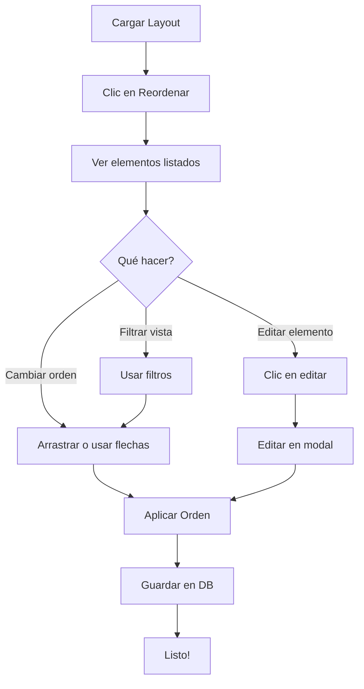

# Guía de Uso: Sistema de Reordenamiento de Plantillas

## 📋 Descripción General

El **Gestor de Plantillas** ahora incluye un sistema visual completo para **editar y reordenar** todos los elementos de una plantilla (secciones, cuentas y operaciones). Esta herramienta permite al usuario controlar exactamente cómo aparecerán los elementos en el módulo final.

---

## 🎯 ¿Para qué sirve?

El sistema de reordenamiento te permite:

1. **Ver el orden actual** de todos los elementos en la plantilla
2. **Reordenar visualmente** arrastrando elementos o usando flechas
3. **Editar propiedades** de secciones, cuentas y operaciones existentes
4. **Entender la jerarquía** con indicadores visuales claros
5. **Filtrar elementos** para trabajar solo con secciones, cuentas u operaciones

---

## 🚀 Cómo Usar

### 1. Abrir el Modal de Reordenamiento

1. Carga un layout (Módulo + Año + Capítulo)
2. Haz clic en el botón **"Reordenar"** (🔀) en la barra de herramientas
3. Se abrirá el modal con todos los elementos listados

### 2. Entender la Interfaz

#### **Números de Orden**
- Cada elemento tiene un **círculo morado** con un número
- Este número indica su **posición actual** en el layout
- El orden se actualiza automáticamente al mover elementos

#### **Íconos de Tipo**
Cada elemento tiene un ícono de color que indica su tipo:

| Ícono | Color | Tipo |
|-------|-------|------|
| 📁 | Azul | Sección Principal |
| 📂 | Cyan | Sección Secundaria |
| 📄 | Gris | Cuenta |
| 🧮 | Verde | Operación |

#### **Badges de Tipo**
Cada elemento muestra un badge con su tipo en mayúsculas:
- `SECCION` - Sección principal (ej: INCOME, EXPENSE)
- `SUBSECCION` - Sección secundaria (ej: Membership Dues)
- `CUENTA` - Cuenta contable con código
- `OPERACION` - Operación de cálculo (ej: TOTAL INCOME)

#### **Detalles del Elemento**
Dependiendo del tipo, se muestran detalles adicionales:
- **Cuentas**: Código contable (ej: `401-001-000-00`)
- **Operaciones**: Fórmula de cálculo (ej: `+ CDMX INCOME - CDMX EXPENSE`)
- **Subsecciones**: Sección padre (ej: `Bajo: INCOME`)

---

## 🎨 Métodos de Reordenamiento

### Método 1: Arrastrar y Soltar (Drag & Drop)

1. Haz clic y **mantén presionado** el ícono de agarre (☰)
2. **Arrastra** el elemento a su nueva posición
3. Cuando esté sobre el destino, verás un **borde verde**
4. **Suelta** para colocar el elemento

**Visual:**
- El elemento arrastrado se vuelve **semitransparente**
- La posición de destino se **resalta en verde**
- Los números se **actualizan automáticamente**

### Método 2: Botones de Flecha

1. Localiza el elemento que quieres mover
2. Haz clic en:
   - **↑ (Arriba)**: Mueve el elemento una posición hacia arriba
   - **↓ (Abajo)**: Mueve el elemento una posición hacia abajo
3. El elemento intercambia posición con el adyacente

**Notas:**
- El primer elemento no tiene botón ↑
- El último elemento no tiene botón ↓
- Los números se actualizan inmediatamente

---

## ✏️ Editar Elementos

### Cómo Editar

1. Localiza el elemento en la lista
2. Haz clic en el botón **✏️ (Editar)**
3. El modal de reordenamiento se cerrará
4. Se abrirá el modal de edición correspondiente

### Qué se puede editar

#### **Secciones**
- Nombre de la sección
- Tipo (Principal o Secundaria)

#### **Cuentas**
- Código de cuenta
- Nombre
- Sección a la que pertenece
- Subsección (si aplica)

#### **Operaciones**
- Identificador único
- Etiqueta/Clase
- Fórmula de cálculo
- Tipo de fila donde aparece

---

## 🔍 Filtros

El sistema incluye filtros para trabajar más fácilmente:

| Filtro | Descripción |
|--------|-------------|
| **Todos** | Muestra todos los elementos (predeterminado) |
| **Secciones** | Solo secciones principales y secundarias |
| **Cuentas** | Solo cuentas contables |
| **Operaciones** | Solo operaciones de cálculo |

**Cómo usar:**
1. Haz clic en el botón del filtro deseado (parte superior del modal)
2. Los elementos filtrados se ocultan temporalmente
3. El reordenamiento afecta solo a los elementos visibles
4. Los números de orden se mantienen consistentes

---

## 💾 Guardar y Aplicar Cambios

### Aplicar Orden

1. Una vez satisfecho con el orden, haz clic en **"Aplicar Orden"** ✅
2. El orden se aplicará al layout principal
3. El modal se cerrará automáticamente
4. Verás un mensaje: *"Orden aplicado correctamente. No olvides guardar."*

### Guardar en Base de Datos

⚠️ **IMPORTANTE**: Los cambios de orden NO se guardan automáticamente.

1. Después de aplicar el orden, haz clic en **"Guardar"** 💾 (barra principal)
2. Esto guardará:
   - El nuevo orden de todos los elementos
   - Cualquier edición realizada
   - La estructura completa del layout

### Cancelar Cambios

- Haz clic en **"Cancelar"** para cerrar sin aplicar cambios
- Los cambios previos NO se perderán si ya aplicaste el orden

### Resetear al Orden Original

1. Haz clic en **"Resetear Orden"** 🔄 (parte inferior del modal)
2. Confirma la acción
3. Todos los elementos volverán a su orden original (al abrir el modal)

---

## 🎯 Jerarquía Visual

El sistema respeta y muestra la jerarquía de elementos:

```
📁 INCOME (Sección Principal)
  📂 Membership Dues (Subsección)
    📄 401-001-000-00 - Cuotas de membresía (Cuenta)
    📄 401-002-000-00 - Cuotas especiales (Cuenta)
  📄 401-100-000-00 - Otros ingresos (Cuenta directa)

🧮 TOTAL INCOME (Operación)
🧮 CONSOLIDATED INCOME (Operación)
```

**Indentación:**
- **Nivel 0**: Secciones principales y operaciones (sin indentación)
- **Nivel 1**: Subsecciones y cuentas directas (40px de margen)
- **Nivel 2**: Cuentas bajo subsecciones (80px de margen)

En dispositivos móviles, la indentación se muestra como **borde izquierdo azul**.

---

## 📱 Responsivo

El sistema funciona en todos los dispositivos:

### Desktop (PC/Laptop)
- Drag & drop completo
- Vista amplia con todos los controles
- Filtros en línea horizontal

### Tablet
- Drag & drop funcional
- Controles más compactos
- Filtros adaptados

### Mobile (Teléfono)
- Drag & drop simplificado
- Botones de flecha más grandes
- Filtros en columna vertical
- Indentación como borde coloreado

---

## 🎨 Indicadores Visuales

### Estados del Elemento

| Efecto | Significado |
|--------|-------------|
| Borde normal (gris) | Estado normal |
| Borde azul + sombra | Al pasar el mouse (hover) |
| Semitransparente + rotado | Se está arrastrando |
| Borde verde + fondo verde claro | Zona de soltar (drop) |
| Número con animación | Orden recién actualizado |

### Colores de Gradiente

Cada tipo de elemento tiene un gradiente único:

- **Secciones**: Azul oscuro → Azul rey
- **Subsecciones**: Cyan → Teal
- **Cuentas**: Gris oscuro → Gris medio
- **Operaciones**: Verde oscuro → Verde bosque
- **Números de orden**: Morado → Púrpura

---

## 🔐 Permisos

El botón "Reordenar" solo está disponible si:

1. ✅ Has cargado un layout válido
2. ✅ Tienes permisos de edición (Admin Global o permiso de capítulo)
3. ✅ Hay elementos en el layout para ordenar

Si no cumples estos requisitos, el botón aparecerá **deshabilitado** (gris).

---

## 💡 Mejores Prácticas

### 1. Orden Lógico
- Agrupa secciones relacionadas
- Mantén cuentas bajo sus subsecciones correspondientes
- Coloca operaciones al final de su contexto

### 2. Consistencia
- Usa el mismo orden en módulos similares
- Respeta la jerarquía (sección → subsección → cuenta)
- Agrupa operaciones por tipo (totales, consolidados, resultados)

### 3. Trabajo Seguro
- **Guarda frecuentemente** después de cambios grandes
- Usa "Resetear" si no estás seguro de los cambios
- Prueba el orden en "Vista Previa" antes de guardar

### 4. Filtros Inteligentes
- Usa filtros cuando trabajes con muchos elementos
- Filtra por tipo para reorganizar solo operaciones o solo cuentas
- Los filtros no afectan el orden final, solo la visualización

---

## ⚠️ Problemas Comunes

### "El botón Reordenar está deshabilitado"
**Solución:**
1. Verifica que hayas cargado un layout
2. Confirma que tienes permisos de edición
3. Asegúrate de que hay elementos en el layout

### "Los cambios no se guardan"
**Solución:**
1. Haz clic en **"Aplicar Orden"** en el modal
2. Luego haz clic en **"Guardar"** en la barra principal
3. Los cambios requieren ambos pasos

### "No puedo arrastrar elementos"
**Solución:**
1. Asegúrate de hacer clic en el ícono ☰ (agarre)
2. Mantén presionado el clic mientras arrastras
3. En móviles, usa los botones de flecha en su lugar

### "Los números no se actualizan"
**Solución:**
- Los números se actualizan automáticamente después de cada cambio
- Si no ves cambios, intenta cerrar y reabrir el modal

---

## 🔄 Flujo de Trabajo Completo



---

## 📊 Ejemplo Práctico

### Escenario: Reordenar el módulo "Membresía"

**Situación inicial:**
1. EXPENSE (arriba)
2. INCOME (abajo)
3. Operaciones mezcladas

**Objetivo:** Colocar INCOME primero, luego EXPENSE, luego operaciones organizadas

**Pasos:**

1. **Abrir reordenamiento**
   - Cargar: Membresía + 2025 + CDMX
   - Clic en "Reordenar" 🔀

2. **Reorganizar secciones**
   - Arrastrar "INCOME" hacia arriba
   - Queda en posición 1

3. **Agrupar operaciones**
   - Filtrar: solo "Operaciones"
   - Arrastrar "TOTAL INCOME" después de cuentas de INCOME
   - Arrastrar "TOTAL EXPENSE" después de cuentas de EXPENSE
   - Arrastrar "NET RESULTS" al final

4. **Verificar**
   - Quitar filtro ("Todos")
   - Revisar jerarquía completa
   - Verificar números de orden

5. **Guardar**
   - "Aplicar Orden" ✅
   - "Guardar" 💾 (barra principal)
   - Confirmar en "Vista Previa" 👁️

**Resultado:**
```
1. 📁 INCOME
2.   📂 Membership Dues
3.     📄 401-001-000-00
4.     📄 401-002-000-00
5. 🧮 TOTAL INCOME
6. 📁 EXPENSE
7.   📂 Administrative
8.     📄 501-001-000-00
9. 🧮 TOTAL EXPENSE
10. 🧮 NET RESULTS
```

---

## 🎓 Tips Avanzados

### Reordenamiento Masivo
- Para mover muchos elementos, usa filtros para aislar el grupo
- Ordena los elementos filtrados
- Cambia al siguiente filtro y continúa

### Copiar Orden a Otro Año
1. Ordena perfectamente un año
2. Guarda los cambios
3. Usa "Copiar a otro año" para replicar la estructura

### Validar Orden con Vista Previa
- Después de reordenar, usa "Vista Previa" 👁️
- Verifica que el orden tiene sentido en el contexto del módulo completo
- La vista previa muestra exactamente cómo se verá en el presupuesto final

### Trabajo Colaborativo
- Si varios usuarios editan, el último en guardar define el orden final
- Comunica cambios grandes de orden al equipo
- Usa nombres descriptivos en operaciones para facilitar el reordenamiento

---

## 🆘 Soporte

Si encuentras problemas no cubiertos en esta guía:

1. Verifica la consola del navegador (F12) para errores
2. Confirma que tienes la última versión del sistema
3. Revisa que no hay cambios sin guardar en el layout
4. Intenta recargar la página y volver a cargar el layout

---

## 🔮 Características Futuras (Posibles)

- **Búsqueda en tiempo real** dentro del modal de reordenamiento
- **Vista compacta** para trabajar con layouts muy grandes
- **Deshacer/Rehacer** cambios de orden
- **Plantillas de orden** predefinidas
- **Exportar/Importar** orden como JSON

---

## 📝 Resumen de Controles

| Acción | Control |
|--------|---------|
| Abrir reordenamiento | Botón "Reordenar" 🔀 |
| Arrastrar elemento | Mantener ícono ☰ |
| Subir una posición | Botón ↑ |
| Bajar una posición | Botón ↓ |
| Editar elemento | Botón ✏️ |
| Aplicar cambios | "Aplicar Orden" ✅ |
| Descartar cambios | "Cancelar" |
| Resetear al inicio | "Resetear Orden" 🔄 |
| Guardar permanente | "Guardar" 💾 (barra principal) |
| Filtrar vista | Botones de filtro (arriba) |

---

## ✅ Checklist de Uso

Antes de cerrar el modal de reordenamiento:

- [ ] ¿El orden tiene sentido lógicamente?
- [ ] ¿Las cuentas están bajo sus secciones correctas?
- [ ] ¿Las operaciones están al final de su contexto?
- [ ] ¿La jerarquía está correcta (indentación)?
- [ ] ¿Apliqué el orden? (botón "Aplicar Orden")
- [ ] ¿Guardé en la base de datos? (botón "Guardar")
- [ ] ¿Verifiqué en Vista Previa?

---

**¡Listo! Ahora tienes control total sobre el orden de aparición de elementos en tus plantillas.** 🎉
