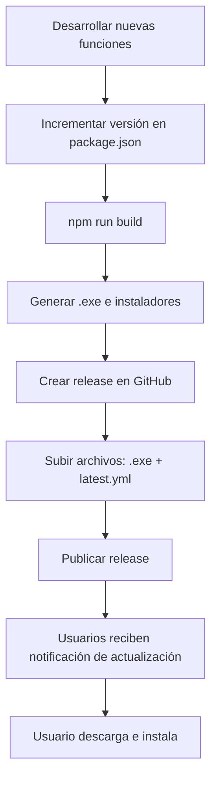

# Sistema de Actualizaciones Automáticas - SummaCham

## 📋 Descripción General

El sistema utiliza **electron-updater** para proporcionar actualizaciones automáticas mediante GitHub Releases. El proceso es no-intrusivo y permite al usuario controlar cuándo descargar e instalar las actualizaciones.

---

## 🔄 Flujo de Actualización

### 1. **Verificación Automática al Iniciar**
- La aplicación verifica actualizaciones 5 segundos después de iniciarse (solo en versión empaquetada)
- Se ejecuta en segundo plano sin interrumpir al usuario

### 2. **Verificación Manual**
- El usuario puede buscar actualizaciones desde el menú del tray: **"Buscar actualizaciones"**
- Disponible en cualquier momento mientras la aplicación está ejecutándose

### 3. **Actualización Disponible**
```
┌─────────────────────────────────────┐
│  Actualización disponible           │
│                                     │
│  Nueva versión X.Y.Z disponible     │
│  Versión actual: A.B.C              │
│  Nueva versión: X.Y.Z               │
│                                     │
│  ¿Deseas descargar e instalar?      │
│                                     │
│  [Descargar ahora]  [Más tarde]    │
└─────────────────────────────────────┘
```

### 4. **Descarga en Progreso**
- Muestra notificación: "Descargando actualización..."
- El título de la ventana muestra el progreso: `Panel AMCHAM - Descargando: 45%`
- El proceso no bloquea el uso de la aplicación

### 5. **Actualización Descargada**
```
┌─────────────────────────────────────┐
│  Actualización lista                │
│                                     │
│  Versión X.Y.Z lista para instalar  │
│                                     │
│  ¿Deseas reiniciar ahora para       │
│  aplicar la actualización?          │
│                                     │
│  [Reiniciar ahora]  [Más tarde]    │
└─────────────────────────────────────┘
```

**Si elige "Reiniciar ahora":**
- La aplicación se cierra
- La actualización se instala automáticamente
- La aplicación se reinicia con la nueva versión

**Si elige "Más tarde":**
- Recibe notificación: "La actualización se instalará cuando cierres la aplicación"
- La actualización se instala automáticamente al cerrar la app (`autoInstallOnAppQuit = true`)

---

## ⚙️ Configuración Técnica

### Archivo: `main.js`
```javascript
const { autoUpdater } = require("electron-updater");

// Configuración
autoUpdater.autoDownload = false;        // No descargar automáticamente
autoUpdater.autoInstallOnAppQuit = true; // Instalar al cerrar si está pendiente
```

### Eventos Implementados
| Evento | Descripción | Acción |
|--------|-------------|--------|
| `checking-for-update` | Iniciando verificación | Log en consola |
| `update-available` | Nueva versión encontrada | Diálogo de confirmación |
| `update-not-available` | Ya está actualizado | Log en consola |
| `download-progress` | Progreso de descarga | Actualiza título de ventana |
| `update-downloaded` | Descarga completada | Diálogo para reiniciar |
| `error` | Error en el proceso | Mensaje de error al usuario |

---

## 📦 Publicación de Actualizaciones

### Paso 1: Incrementar Versión
```powershell
# Editar package.json
"version": "1.0.1"  # Nueva versión
```

### Paso 2: Construir la Aplicación
```powershell
npm run build
# O para portable:
npm run build:portable
```

Esto genera:
- `dist/SummaCham Setup 1.0.1.exe` (instalador NSIS)
- `dist/SummaCham 1.0.1.exe` (versión portable)
- `dist/latest.yml` (metadata para actualizaciones)

### Paso 3: Crear Release en GitHub
```powershell
# Opción 1: Publicar automáticamente
npm run publish

# Opción 2: Manual en GitHub
# 1. Ir a: https://github.com/IustusRenidet/SummaCham/releases/new
# 2. Tag version: v1.0.1
# 3. Release title: v1.0.1
# 4. Subir archivos:
#    - SummaCham Setup 1.0.1.exe
#    - SummaCham 1.0.1.exe
#    - latest.yml
# 5. Publicar release
```

### Archivos Requeridos en el Release
```
✓ SummaCham Setup X.Y.Z.exe   (Instalador NSIS - x64)
✓ SummaCham Setup X.Y.Z-ia32.exe   (Instalador NSIS - 32-bit)
✓ SummaCham X.Y.Z.exe         (Portable - x64)
✓ SummaCham X.Y.Z-ia32.exe    (Portable - 32-bit)
✓ latest.yml                  (Metadata - REQUERIDO)
```

---

## 🔍 Verificación del Sistema

### Comprobar Configuración
```javascript
// En main.js - verifica que existan:
const { autoUpdater } = require("electron-updater");
autoUpdater.autoDownload = false;
autoUpdater.autoInstallOnAppQuit = true;
```

### Comprobar package.json
```json
{
  "version": "1.0.0",
  "build": {
    "publish": [{
      "provider": "github",
      "owner": "IustusRenidet",
      "repo": "SummaCham"
    }]
  }
}
```

### Logs de Depuración
El sistema escribe logs en consola:
```
🔍 Verificando actualizaciones...
✨ Nueva actualización disponible: 1.0.1
✓ Aplicación actualizada (versión 1.0.0)
❌ Error en auto-updater: ...
```

---

## 📌 Notas Importantes

### ⚠️ Solo en Versión Empaquetada
- Las actualizaciones **NO funcionan en modo desarrollo** (`npm start`)
- Solo funcionan en la aplicación compilada (`.exe`)

### 🔐 Requisitos de GitHub
- El repositorio debe ser público O tener un token de acceso configurado
- Los releases deben estar publicados (no draft)
- El archivo `latest.yml` es **OBLIGATORIO** en cada release

### 🎯 Estrategia de Versiones
- Usar **Semantic Versioning**: `MAJOR.MINOR.PATCH`
  - `MAJOR`: Cambios incompatibles
  - `MINOR`: Nueva funcionalidad compatible
  - `PATCH`: Correcciones de bugs

### 💾 Persistencia de Datos
- Las actualizaciones **NO borran**:
  - Base de datos SQLite (`usuarios.db`)
  - Configuración de usuario
  - Archivos en carpeta de datos
- Solo se reemplaza el ejecutable y archivos de la aplicación

---

## 🧪 Pruebas

### Probar Actualización Localmente
```powershell
# 1. Compilar versión 1.0.0
npm run build

# 2. Instalar versión 1.0.0
# Ejecutar: dist/SummaCham Setup 1.0.0.exe

# 3. Cambiar version a 1.0.1 en package.json

# 4. Compilar nueva versión
npm run build

# 5. Crear release en GitHub con archivos de 1.0.1

# 6. Abrir app versión 1.0.0
# Ir a tray > "Buscar actualizaciones"
# Verificar que detecta la 1.0.1
```

---

## 🚀 Flujo Completo de Despliegue



---

## 📞 Solución de Problemas

### "No se detectan actualizaciones"
1. Verificar que `app.isPackaged === true`
2. Comprobar que existe release en GitHub
3. Verificar que `latest.yml` está en el release
4. Revisar logs en consola del Electron

### "Error al descargar actualización"
1. Verificar conexión a internet
2. Comprobar que el release es público
3. Verificar que los archivos no están corruptos

### "La actualización no se instala"
1. Verificar permisos de escritura en carpeta de instalación
2. Comprobar que no hay antivirus bloqueando
3. Verificar que `autoInstallOnAppQuit = true`

---

## 📚 Referencias

- [electron-updater Documentation](https://www.electron.build/auto-update)
- [GitHub Releases API](https://docs.github.com/en/rest/releases)
- [Electron Builder](https://www.electron.build/)
